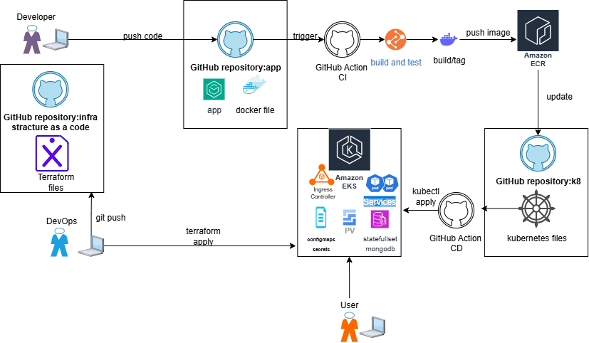

# Fighting Characters – Kubernetes Manifests

> Kubernetes manifests to **deploy** the Fighting Characters application on AWS EKS.

## Overview
This repository provides Kubernetes manifests and a Kustomize setup to deploy the Fighting Characters project on EKS.

Key components:
- **MongoDB** provisioned via **Bitnami Helm chart** (StatefulSet + PVC)
- **Flask App Deployment** (Gunicorn-based container from AWS ECR)
- **Service** (ClusterIP for app, internal Service for MongoDB)
- **Ingress** (via Nginx Ingress Controller)
- **ConfigMaps / Secrets** managed through Kustomize and GitHub Actions CD

## Architecture


- Namespace: `fighting-characters`
- MongoDB (Helm chart → StatefulSet with PersistentVolumeClaims)
- Flask App Deployment (ECR container with Gunicorn)
- Service for app (ClusterIP / LoadBalancer depending on ingress)
- Ingress via Nginx Ingress Controller

## Repository Structure

```
k8/
├── kustomization.yaml        # root: pulls Helm (Mongo) + app/
├── mongodb-values.yaml       # Helm values for MongoDB
└── app/
    ├── kustomization.yaml    # app-only kustomize
    ├── app.env               # non-sensitive env (ConfigMap generator)
    ├── secret.yaml           # optional placeholder (or managed via CD)
    ├── service.yaml          # Service for Flask API
    └── deployment.yaml       # Deployment for Flask API
```

## Prerequisites
- **kubectl** configured for AWS EKS
- **Nginx Ingress Controller** installed in the cluster
- **AWS CLI** with valid IAM permissions (via OIDC for GitHub Actions)
- **ECR repository** with the latest app image pushed
- **GitHub Actions secrets** for `MONGO_URI` and `APP_SECRET_KEY`

## Getting Started
```bash
# Deploy all resources (MongoDB + app)
kubectl apply -k k8/
```

Check status:
```bash
kubectl get pods -n fighting-characters
kubectl get svc -n fighting-characters
kubectl get ingress -n fighting-characters
```

Expected: External IP/DNS is assigned to the Ingress, app is accessible.

## CI/CD Pipeline
Deployment is automated via GitHub Actions CD workflow:
- Triggered after pushing a new Docker image to AWS ECR
- Uses OIDC to authenticate with AWS
- Applies manifests with `kubectl apply -k k8/`
- Updates image inside the Deployment
- Runs smoke tests post-rollout


## Release History
- 0.4.0 – Switch to Helm (MongoDB) + Kustomize (app), CD workflow updated  
- 0.3.2 – Add ICEMAN character manifests, ingress fix  
- 0.3.0 – Add app Deployment + Service  
- 0.2.0 – Add MongoDB StatefulSet  
- 0.1.0 – Initial repo structure  

## Contact
Ben Shavit – [LinkedIn](https://www.linkedin.com/in/ben-shavit-b07953142/) – shavitben5@hotmail.com  

**Related Repositories**
- [Application (Flask + Docker)](https://github.com/Trunkssj3/fighting-characters-app)  
- [Infrastructure (Terraform)](https://github.com/Trunkssj3/fighting-characters-infra)  

## Acknowledgments
- Kubernetes community  
- Bitnami Helm charts  
- AWS EKS documentation  
- Develeap instructors  
