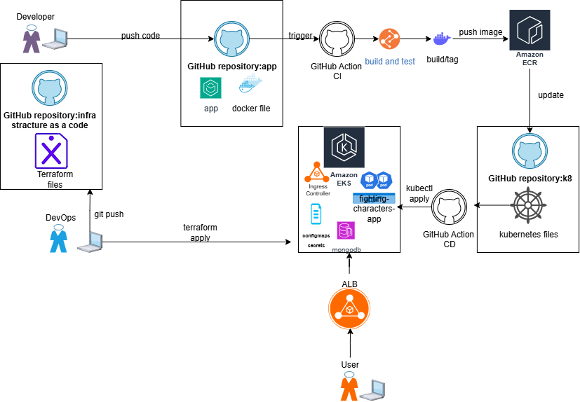
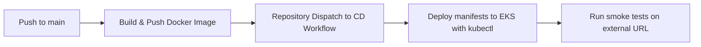

# Fighting Characters – Kubernetes Manifests

> Kubernetes YAML manifests to deploy the Fighting Characters application on AWS EKS.

## Overview
This repository holds K8s manifests for:
- **Deployment** of Flask app (Gunicorn)
- **Service** (ClusterIP / LoadBalancer)
- **Ingress** (via Nginx ingress controller)
- **ConfigMaps / Secrets**
- **Persistent Volumes (MongoDB)**

## Architecture


- Namespace: `fighting-characters`
- MongoDB StatefulSet (with PersistentVolumeClaims)
- Flask App Deployment (Gunicorn-based container from ECR)
- Service (internal + external)
- Ingress via Nginx Ingress Controller

## Getting Started
```bash
kubectl apply -f namespace.yaml
kubectl apply -f mongo/
kubectl apply -f app/
kubectl apply -f ingress/
```

Check status:
```bash
kubectl get pods -n fighting-characters
kubectl get svc -n fighting-characters
```

---

# Fighting Characters – Kubernetes (Detailed)

> Full Kubernetes deployment for the Fighting Characters portfolio project.

## Table of Contents

- [Overview](#overview-detailed)
- [Architecture](#architecture-detailed)
- [Technology Stack](#technology-stack)
- [Repository Structure](#repository-structure)
- [Prerequisites](#prerequisites)
- [Getting Started](#getting-started-detailed)
- [CI/CD Pipeline](#cicd-pipeline)
- [Contributing](#contributing)
- [Release History](#release-history)
- [Contact](#contact)
- [Acknowledgments](#acknowledgments)

## Overview (Detailed)

This repository demonstrates a **Kubernetes-based deployment** of the Flask application.  
It integrates with AWS EKS, uses MongoDB as a StatefulSet with persistent volumes, and exposes the app via an Nginx Ingress Controller.

Key features:
- Namespace isolation (`fighting-characters`)
- Separation of concerns: `mongo/`, `app/`, `ingress/`
- Configurable via ConfigMaps and Secrets
- Compatible with AWS EKS + GitHub Actions CD pipeline

## Architecture (Detailed)


- **Users → Ingress (Nginx)** → Routes traffic to Flask service
- **App Deployment** runs containerized Flask API
- **MongoDB StatefulSet** provides persistence with EBS volumes
- **Services** expose both app and DB internally
- **Ingress** exposes app externally

## Technology Stack

| Category             | Technologies                          |
| -------------------- | ------------------------------------- |
| **Infrastructure**   | AWS EKS                               |
| **Containerization** | Docker                                |
| **CI/CD**            | GitHub Actions, kubectl/Helm          |
| **Version Control**  | Git, GitHub                           |
| **Security**         | Kubernetes Secrets, IAM via OIDC      |
| **Application**      | Python Flask app (Gunicorn container) |
| **Database**         | MongoDB StatefulSet                   |

## Repository Structure

```
k8s/
├── namespace.yaml     # Namespace definition
├── mongo/             # StatefulSet + Service + PVC for MongoDB
├── app/               # Deployment + Service for Flask API
└── ingress/           # Ingress rules (Nginx)
```

## Prerequisites

- kubectl configured for AWS EKS
- Nginx Ingress Controller installed
- AWS CLI with valid permissions
- ECR repository with latest app image pushed

## Getting Started (Detailed)

```bash
kubectl apply -f namespace.yaml
kubectl apply -f mongo/
kubectl apply -f app/
kubectl apply -f ingress/
```

Check deployment:

```bash
kubectl get pods -n fighting-characters
kubectl get svc -n fighting-characters
kubectl get ingress -n fighting-characters
```

Expected result: External IP/DNS exposed to access the app.

## CI/CD Pipeline

Deployment is automated via GitHub Actions CD workflow:  
- Triggered after image push to AWS ECR.  
- Uses `kubectl` with OIDC IAM role.  
- Applies updated manifests (`kubectl apply -f`).  
- Smoke tests run after rollout.



## Contributing

1. Fork repo
2. Create feature branch (`git checkout -b feature/[NAME]`)
3. Commit changes (`git commit -m "..."`)
4. Push branch (`git push origin feature/[NAME]`)
5. Open Pull Request

## Release History

- 0.3.2 – ADD: ICEMAN character manifests, ingress fix
- 0.3.0 – ADD: App deployment + service
- 0.2.0 – ADD: MongoDB StatefulSet
- 0.1.0 – Initial repo structure

## Contact

Ben Shavit – [LinkedIn](https://www.linkedin.com/in/ben-shavit-b07953142/) – shavitben5@hotmail.com  

**Related Repositories**
- [Application (Flask + Docker)](https://github.com/Trunkssj3/fighting-characters-app)
- [Infrastructure (Terraform)](https://github.com/Trunkssj3/fighting-characters-infra)

## Acknowledgments

- Kubernetes community  
- AWS EKS documentation  
- Develeap instructors  
